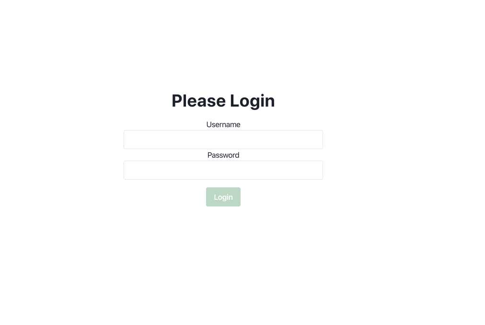

# Login Challenge

This repo currenlty only contains a skeleton react app.

The goal is to create an app that has two subcomponents, one for logged in users and one for logged out users. If the user is not logged in, the Login component with a login form should be displayed. Once the user is logged in, then the Secure component will be displayed with the user's name and the ability to log the user out.

Users that have not logged in should not be able to view the Secure component.

There is a mock API library in the `src/lib` directory that you can use for authentication. This is an async function that returns a promise. The payload is expected to be an object with a **username** and **password** property. The only rules of this API library is that the username must exist and the password must be "postal".

You are free to style the app (or not) in any way you like. Tests are not required for this app, however, you may do so with any testing library that you are familiar with if it will help your workflow.

MOCK API EXAMPLE

```
import api from './lib/api'


try {
  const user = await api.login({username: 'myname', password: 'postal'})
  console.log(user) // { username: "myname" }
} catch(err) {
  console.log(err.message) // Invalid Login
}
```

## Example



## Setup

A recent nodejs is required.

First fork this repo into your own github account. Once you've made a fork of the repo, clone the fork to your local machine.

When you are done with the coding challenge, go ahead and push it back up to github. You can do multiple pushes if you'd like. The goal is to complete this in under 2 hours, but if you need more time that is fine as we will review it tomorrow.

```
# install the dependencies
npm install

# start the app
npm start
```
